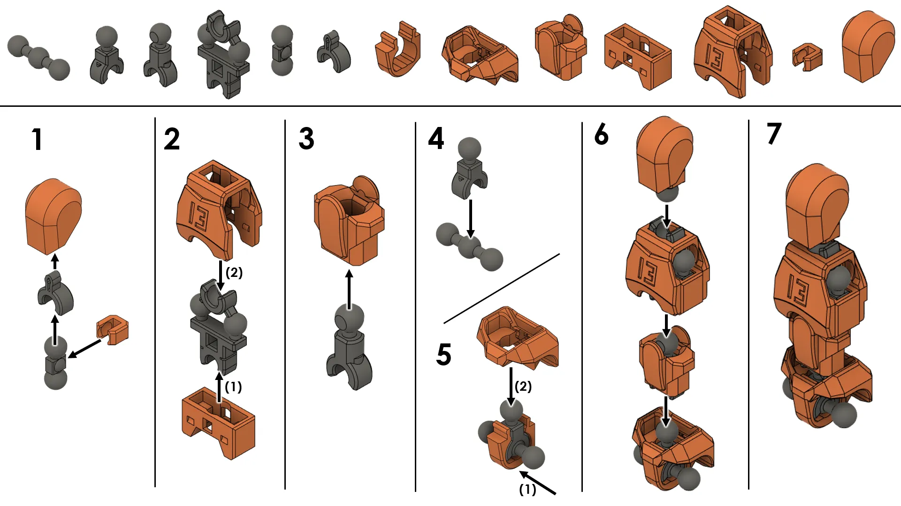
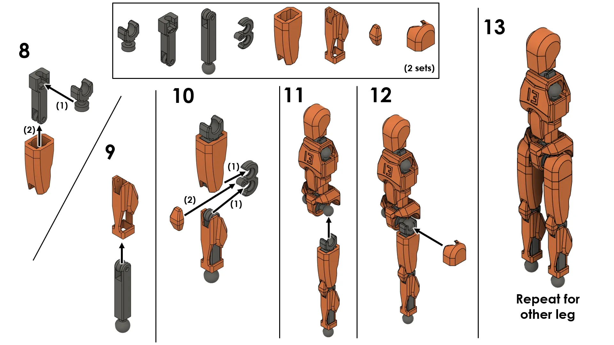
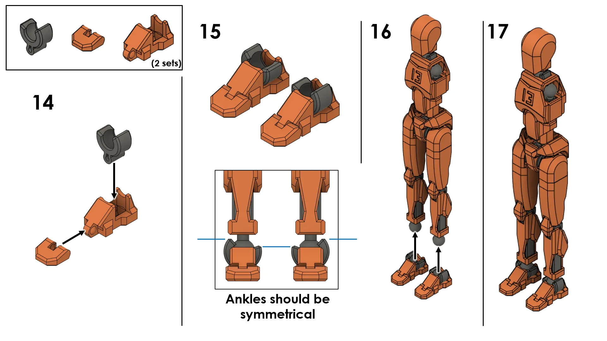
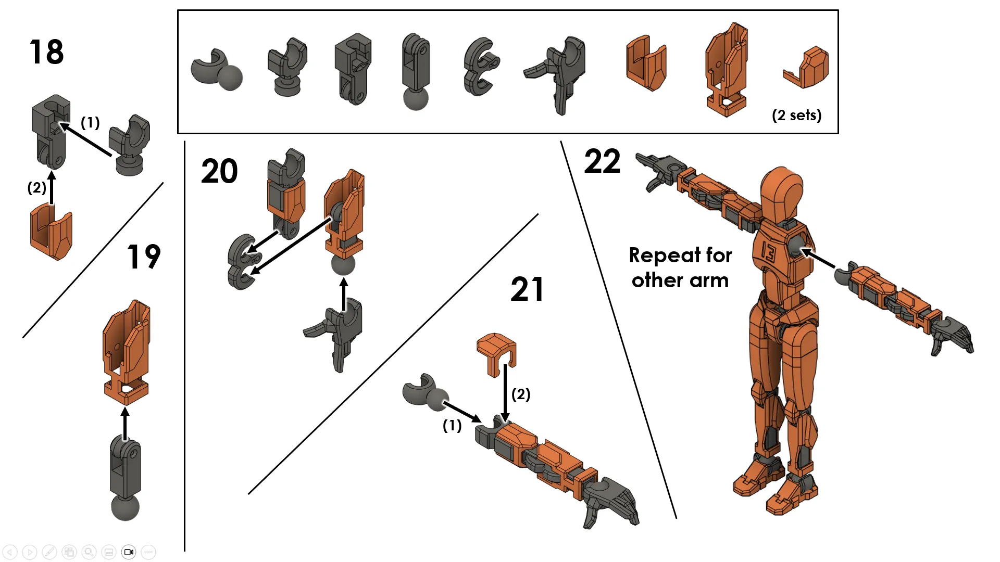
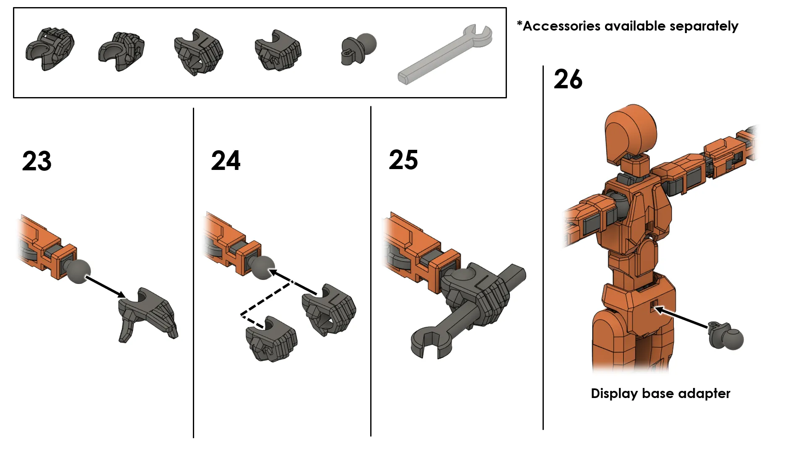

# Dummy 13 Assembly Guide

Welcome to the Dummy 13 Assembly Guide! This 3D-printed robot is assembled from multiple parts, and I’m here to support you along the way. If you run into broken pieces, need replacements, or want alternate parts (like different hands) printed, just let me know—I’m happy to help. I hope you enjoy building your Dummy 13 as much as I’ve enjoyed sharing it with you!

## Steps
### 1

### 2

### 3

### 4

### 5

## Links
- [PDF](./dummy-13-v1_0%20assembly%20guide.pdf)
- [Model on Makerworld](https://makerworld.com/en/models/638587)
